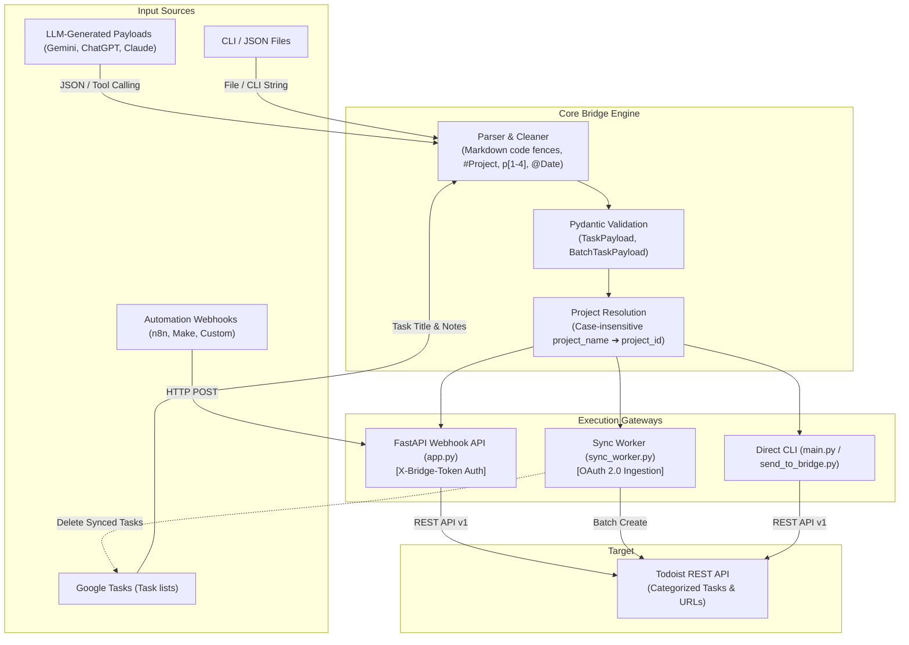

# Todoist Gemini Bridge 🌉

<p align="center">
  
  
  
  
  
  
  
</p>

<p align="center">
  A lightweight automation bridge that turns structured AI or Google Tasks input into validated Todoist tasks using FastAPI, Pydantic, OAuth 2.0, and the Todoist REST API.
</p>

<p align="center">
  <a href="#architecture">Architecture</a> •
  <a href="#features">Features</a> •
  <a href="#project-structure">Project Structure</a> •
  <a href="#getting-started">Getting Started</a> •
  <a href="#usage">Usage</a> •
  <a href="#testing">Testing</a> •
  <a href="#türkçe">Türkçe</a>
</p>

---

<a name="architecture"></a>
## 🏗️ Architecture



---

<a name="features"></a>
## 🌟 Features

- **Pydantic Validation:** Type-safe schema validation for individual and batch task creation payloads.
- **Markdown & JSON Extraction:** Automatic extraction of JSON payloads from raw LLM responses wrapped in markdown code blocks.
- **Google Tasks → Todoist Sync Worker (`sync_worker.py`):** OAuth 2.0 worker that ingests tasks from Google Tasks, extracts inline tags (`#Project`, `p[1-4]`, `@Date`), creates them in Todoist, and removes successfully processed tasks from Google Tasks.
- **Project Resolution:** Resolves human-readable `project_name` to Todoist `project_id` using case-insensitive matching, falling back safely to `Inbox`.
- **FastAPI Webhook API (`app.py`):** REST endpoints with CORS support and pre-shared token authentication (`X-Bridge-Token`).
- **CLI Dispatcher (`send_to_bridge.py`):** Command-line client to transmit task payloads to your self-hosted bridge server.
- **Direct CLI Runner (`main.py`):** Standalone script to create tasks directly in Todoist without running a server.
- **Gemini Tool Declaration (`gemini_tool_schema.json`):** Function calling schema for Google Gemini SDK integrations.
- **Todoist REST API v1:** Fully compliant with current Todoist API endpoints (`https://api.todoist.com/api/v1`).
- **Terminal Summary:** Formatted table output with direct URLs to created tasks on Todoist.

---

<a name="project-structure"></a>
## 📁 Project Structure

```text
Todoist-Gemini-Bridge/
├── app.py                  # FastAPI Webhook API & REST endpoints
├── send_to_bridge.py       # Standalone CLI client for FastAPI webhook
├── sync_worker.py          # Google Tasks → Todoist sync worker
├── config.py               # Environment variables & Pydantic settings
├── models.py               # TaskPayload & BatchTaskPayload schemas
├── parser.py               # JSON cleaner and parser
├── todoist_client.py       # Todoist REST API client with error handling
├── main.py                 # Direct Todoist CLI runner & table formatter
├── gemini_tool_schema.json # Gemini Function Calling / Tool Schema
├── tasks_sample.json       # Sample task template
├── tests/                  # Pytest suite (19 unit & integration tests)
├── requirements.txt        # Python dependencies
└── .env.example            # Environment variable template
```

---

<a name="getting-started"></a>
## 🚀 Getting Started

### 1. Clone the Repository
```bash
git clone https://github.com/kagankurubas/Todoist-Gemini-Bridge.git
cd Todoist-Gemini-Bridge
```

### 2. Set Up Virtual Environment & Dependencies
```bash
python -m venv venv

# Windows (PowerShell):
.\venv\Scripts\activate

# macOS / Linux:
source venv/bin/activate

pip install -r requirements.txt
```

### 3. Configure API Credentials
Copy `.env.example` to `.env` and fill in your credentials:
```bash
cp .env.example .env
```
Inside `.env`:
```env
TODOIST_API_TOKEN=your_todoist_api_token_here
WEBHOOK_SECRET_TOKEN=supersecret
```

---

<a name="usage"></a>
## 🛠️ Usage

### 1. Google Tasks → Todoist Sync Worker
Reads tasks from Google Tasks, parses inline tags (`#Project`, `p[1-4]`, `@Date`), creates them in Todoist, and removes them from Google Tasks:
```bash
# Continuous polling mode (default: 15s interval)
python sync_worker.py --watch --interval 15

# One-shot synchronization
python sync_worker.py
```

### 2. Direct CLI (No Server Required)
Creates tasks directly in Todoist from JSON input:
```bash
# From a JSON file
python main.py --file tasks_sample.json

# From a direct JSON string
python main.py --json '[{"content": "Read book", "due_string": "today", "priority": 2}]'

# Interactive input (paste JSON and press Ctrl+Z / Enter on Windows, Ctrl+D on Unix)
python main.py
```

### 3. FastAPI Webhook API (`app.py`)
Run the webhook server:
```bash
uvicorn app:app --reload --port 8000
```
Interactive Swagger API documentation: `http://127.0.0.1:8000/docs`.

**Example cURL Request:**
```bash
curl -X POST "http://127.0.0.1:8000/tasks" \
  -H "Content-Type: application/json" \
  -H "X-Bridge-Token: supersecret" \
  -d '[
    {
      "content": "Review Pull Requests",
      "project_name": "Inbox",
      "due_string": "tomorrow at 10:00",
      "priority": 3
    }
  ]'
```

### 4. Dispatcher Client (`send_to_bridge.py`)
Sends task payloads to your running FastAPI server:
```bash
python send_to_bridge.py --file tasks_sample.json
```

### 5. Gemini Function Calling
Use [gemini_tool_schema.json](gemini_tool_schema.json) with the Google Generative AI Python SDK to let Gemini produce structured task payloads matching the bridge schema.

---

<a name="testing"></a>
## 🧪 Testing

The test suite includes **19 automated unit and integration tests** covering JSON parsing, tag extraction, project resolution, and API authentication/endpoints:

```bash
# Run all tests
pytest

# Run with verbose output
pytest -v
```

---

<a name="example-payload"></a>
## 📋 Example Payload

```json
[
  {
    "content": "Read 10 pages of book",
    "project_name": "Focus & Growth",
    "due_string": "today",
    "priority": 2,
    "description": "Daily reading habit goal"
  },
  {
    "content": "Review pull requests",
    "project_name": "Inbox",
    "due_string": "tomorrow",
    "priority": 3,
    "description": "Check open PRs on GitHub"
  }
]
```

---

<a name="türkçe"></a>
## 🇹🇷 Türkçe

Yapay zeka modellerinden (Gemini, ChatGPT, Claude) veya otomasyon araçlarından (Google Tasks, n8n, Make) üretilen yapılandırılmış görev verilerini Todoist REST API üzerinden doğrulayarak ilgili projelere ve tarihlere aktaran otomasyon köprüsü.

### 🌟 Özellikler

- **Pydantic Şema Doğrulama:** Tekil ve toplu görev verilerini tip güvenliği ile doğrular.
- **Google Tasks → Todoist Senkronizasyonu (`sync_worker.py`):** Google Tasks üzerindeki görevleri okur, satır içi etiketleri (`#Proje`, `p[1-4]`, `@Tarih`) ayrıştırır, Todoist'e aktarır ve aktarılan görevleri Google Tasks'ten siler.
- **Markdown & JSON Ayıklama:** LLM çıktılarındaki markdown kod bloklarını temizler.
- **Proje Eşleme:** Belirtilen `project_name` değerini Todoist'teki `project_id` ile büyük/küçük harf duyarsız eşleştirir; eşleşmeyenleri `Inbox`'a yönlendirir.
- **FastAPI Webhook API (`app.py`):** CORS desteği ve `X-Bridge-Token` başlık kimlik doğrulaması içeren REST uç noktaları.
- **İstemci Script'i (`send_to_bridge.py`):** Webhook sunucusuna komut satırından görev gönderir.
- **Doğrudan CLI (`main.py`):** Sunucu çalıştırmadan doğrudan Todoist'e görev ekler.
- **Gemini Araç Şeması (`gemini_tool_schema.json`):** Gemini Function Calling için hazır araç şeması.

### 🚀 Kullanım

```bash
# 1. Google Tasks Senkronizasyonu (15 saniye aralıkla dinleme)
python sync_worker.py --watch --interval 15

# 2. Doğrudan CLI ile Dosyadan Görev Ekleme
python main.py --file tasks_sample.json

# 3. FastAPI Webhook Sunucusunu Başlatma
uvicorn app:app --reload --port 8000

# 4. Webhook Sunucusuna İstemci ile Görev Gönderme
python send_to_bridge.py --file tasks_sample.json

# 5. Testleri Çalıştırma
pytest -v
```

---

<a name="license"></a>
## 📄 License / Lisans

This project is licensed under the [MIT License](LICENSE).  
Bu proje [MIT Lisansı](LICENSE) kapsamında lisanslanmıştır.
