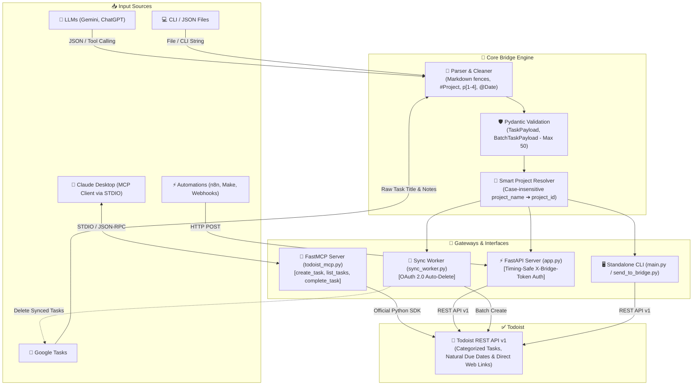

# Todoist Gemini Bridge 🌉

<p align="center">
  
  
  
  
  
  
  
  
</p>

<p align="center">
  <strong>An automation bridge and local Model Context Protocol (MCP) server that converts AI/LLM outputs and Google Tasks into structured Todoist tasks with smart project routing, natural language due dates, and validation.</strong>
</p>

<p align="center">
  <a href="#english">English</a> •
  <a href="#türkçe">Türkçe</a> •
  <a href="#architecture">Architecture</a> •
  <a href="#tests">Tests</a>
</p>

---

<a name="architecture"></a>
## 🏗️ Architecture & Data Flow / Mimari Akış



---

<a name="english"></a>
## 🇬🇧 English

Todoist Gemini Bridge is an open-source Python automation toolkit and local **Model Context Protocol (MCP)** server. It enables AI assistants (such as Claude Desktop), automation workflows (Google Tasks, n8n, Make), and developers to interact with Todoist using smart project resolution, natural language recurring schedules, and strict schema validation.

### 🌟 Key Features

- **🤖 Model Context Protocol (MCP) Server (`todoist_mcp.py`):** FastMCP server over STDIO for Claude Desktop with tools to create (`create_task`), query/filter (`list_tasks`), and complete (`complete_task`) Todoist tasks with sanitized error handling.
- **🛡️ Pydantic & Batch Validation:** Strict type-safe schema verification with a 50-task maximum batch limit for both dictionary and list payloads.
- **📱 Google Tasks → Todoist Sync Worker (`sync_worker.py`):** OAuth 2.0 daemon that synchronizes tasks from Google Tasks, parses tags (`#Project`, `p[1-4]`, `@Date`), pushes them to Todoist, and cleans up Google Tasks.
- **🎯 Smart Project Resolution:** Dynamically maps human-readable project names (case-insensitive with Unicode normalization) to Todoist `project_id`. Defaults safely to `Inbox` if not found.
- **⚡ FastAPI Webhook API (`app.py`):** REST API with timing-attack safe header authentication (`X-Bridge-Token`) and configurable CORS origin filtering.
- **🧹 Markdown & JSON Extraction:** Automatically strips markdown code fences (````json ... ````) from raw LLM outputs.
- **💻 Standalone CLI Tools:** Direct execution script (`main.py`) and webhook dispatcher client (`send_to_bridge.py`).
- **🤖 Gemini Function Calling Ready (`gemini_tool_schema.json`):** Pre-configured JSON schema for Google Gemini tool use.

### 📁 Project Structure

```text
Todoist-Gemini-Bridge/
├── todoist_mcp.py          # FastMCP server for Claude Desktop (STDIO)
├── app.py                  # FastAPI Web Application & REST API
├── send_to_bridge.py       # Standalone CLI client for FastAPI webhook
├── sync_worker.py          # Google Tasks → Todoist sync worker (OAuth 2.0)
├── config.py               # Environment variables & Pydantic settings
├── models.py               # TaskPayload & BatchTaskPayload Pydantic schemas
├── parser.py               # JSON cleaner and tag extractor
├── todoist_client.py       # Todoist REST API client with error handling
├── main.py                 # Direct Todoist CLI runner & table formatter
├── gemini_tool_schema.json # Gemini Function Calling / Tool Schema
├── tasks_sample.json       # Sample task template
├── tests/                  # Pytest test suite (59 unit & integration tests)
├── Dockerfile              # Docker container (runs sync_worker.py by default)
├── .dockerignore           # Excluded files for Docker build context
├── requirements.txt        # Python dependencies
└── .env.example            # Environment variable template
```

---

### 🚀 Getting Started

#### 1. Clone the Repository
```bash
git clone https://github.com/kagankurubas/Todoist-Gemini-Bridge.git
cd Todoist-Gemini-Bridge
```

#### 2. Create Virtual Environment & Install Dependencies
```bash
# Create virtual environment
python -m venv venv

# Activate virtual environment
# Windows (PowerShell):
.\venv\Scripts\activate
# macOS / Linux:
source venv/bin/activate

# Install required packages
pip install -r requirements.txt
```

#### 3. Configure Environment Variables
Copy `.env.example` to `.env`:
```bash
cp .env.example .env
```

Edit your `.env` file with your own credentials:
```env
TODOIST_API_TOKEN=your_todoist_api_token_here
WEBHOOK_SECRET_TOKEN=your_strong_random_secret_token_here
```

**How to obtain your credentials:**
- **`TODOIST_API_TOKEN`**: Log into [Todoist Web](https://todoist.com) ➔ Settings ➔ **Integrations** ➔ **Developer** ➔ Copy your API token.
- **`WEBHOOK_SECRET_TOKEN`**: Generate a strong random string (e.g. `openssl rand -hex 16`) to secure incoming webhook requests.

> [!CAUTION]
> **🔒 Security Considerations:**
> - **Authentication:** Operational endpoints (`/projects`, `/tasks`) are secured via the pre-shared `X-Bridge-Token` header using constant-time verification.
> - **Network Exposure:** Do **not** expose the FastAPI server directly to the public internet. Run it within a trusted local network, behind a TLS-enabled reverse proxy (e.g. Nginx, Caddy), or over a private VPN (e.g. Tailscale, WireGuard).
> - **Secret Management:** Keep `.env`, `credentials.json`, and `token.json` private. They are pre-configured in `.gitignore` and must never be committed to Git.

---

### 🛠️ Usage Methods

#### Method 1: Claude Desktop (Model Context Protocol - MCP)
Integrate Todoist directly into your Claude Desktop application.

1. Open `%APPDATA%\Claude\claude_desktop_config.json` (or **Settings ➔ Developer ➔ Edit Config** in Claude Desktop).
2. Add the `todoist` server configuration (replace path with your project path):
```json
{
  "mcpServers": {
    "todoist": {
      "command": "D:\\Todoist Gemini Bridge\\venv\\Scripts\\python.exe",
      "args": [
        "D:\\Todoist Gemini Bridge\\todoist_mcp.py"
      ],
      "env": {
        "PYTHONIOENCODING": "utf-8"
      }
    }
  }
}
```
3. Restart Claude Desktop. You can now prompt Claude:
   - *"List my open tasks in Todoist for today."*
   - *"Create a p2 task 'Prepare weekly report' due tomorrow at 14:00."*
   - *"Complete task ID 6hM2..."*

---

#### Method 2: Google Tasks Sync Worker (`sync_worker.py`)
Automatically reads tasks from Google Tasks, extracts tags (`#Project`, `p[1-4]`, `@Date`), creates them in Todoist, and removes them from Google Tasks.

*(Requires Google Cloud Console OAuth Desktop Client `credentials.json` in the root folder).*

```bash
# Continuous watcher mode (checks every 15 seconds)
python sync_worker.py --watch --interval 15

# One-shot synchronization
python sync_worker.py
```

---

#### Method 3: Standalone CLI (`main.py`)
Create tasks directly from the terminal without running any background server:

```bash
# From a JSON file
python main.py --file tasks_sample.json

# From an inline JSON string
python main.py --json '[{"content": "Read documentation", "due_string": "today", "priority": 2}]'

# Interactive input (paste JSON and press Ctrl+Z / Enter on Windows, Ctrl+D on Unix)
python main.py
```

---

#### Method 4: FastAPI Webhook Service (`app.py`)
Run the bridge as a persistent HTTP REST server:

```bash
uvicorn app:app --port 8000
```
Interactive Swagger Documentation: `http://127.0.0.1:8000/docs`.

**Example cURL Request:**
```bash
curl -X POST "http://127.0.0.1:8000/tasks" \
  -H "Content-Type: application/json" \
  -H "X-Bridge-Token: your_strong_random_secret_token_here" \
  -d '[
    {
      "content": "Review Pull Requests",
      "project_name": "Inbox",
      "due_string": "tomorrow at 10:00",
      "priority": 3
    }
  ]'
```

---

#### Method 5: Webhook Dispatcher Client (`send_to_bridge.py`)
Send tasks from a JSON file to your running FastAPI webhook server:
```bash
python send_to_bridge.py --file tasks_sample.json
```

---

<a name="türkçe"></a>
## 🇹🇷 Türkçe

Todoist Gemini Bridge, yapay zeka modelleri (Claude Desktop, Gemini, ChatGPT), otomasyon araçları (Google Tasks, n8n, Make) veya geliştiricilerin Todoist ile etkileşime geçmesini sağlayan açık kaynaklı bir Python köprüsü ve **Model Context Protocol (MCP)** sunucusudur.

### 🌟 Öne Çıkan Özellikler

- **🤖 Model Context Protocol (MCP) Sunucusu (`todoist_mcp.py`):** Claude Desktop için FastMCP mimarisiyle yerel STDIO üzerinden çalışan; görev oluşturma (`create_task`), listeleme (`list_tasks`) ve tamamlama (`complete_task`) araçları.
- **🛡️ Pydantic ile Doğrulama & Toplu İşlem Limiti:** Tekil veya toplu görev verilerinin tiplerini doğrular; tek seferde en fazla 50 görev sınırını hem liste hem sözlük formatında zorunlu kılar.
- **📱 Google Tasks → Todoist Senkronizasyonu (`sync_worker.py`):** Google Tasks'teki görevleri okur, etiketleri (`#Proje`, `p[1-4]`, `@Tarih`) ayrıştırır, Todoist'e aktarır ve aktarılanları siler.
- **🎯 Akıllı Proje Eşleme:** Proje isimlerini (`project_name`) büyük/küçük harf duyarsız ve Türkçe karakter uyumlu olarak dinamik Todoist proje ID'lerine eşler; bulunamazsa güvenli bir şekilde `Gelen Kutusu`na (Inbox) yönlendirir.
- **⚡ FastAPI Webhook API (`app.py`):** Zamanlama saldırılarına korumalı (timing-safe) `X-Bridge-Token` başlık doğrulaması ve yapılandırılabilir CORS köken filtreleme desteği içeren REST servisi.
- **🧹 Markdown & JSON Ayıklama:** LLM çıktılarındaki markdown formatlı kod bloklarını (````json ... ````) otomatik olarak temizler.
- **💻 Bağımsız CLI Araçları:** Sunucusuz doğrudan görev ekleme (`main.py`) ve webhook istemcisi (`send_to_bridge.py`).

### 📁 Proje Yapısı

```text
Todoist-Gemini-Bridge/
├── todoist_mcp.py          # Claude Desktop için FastMCP sunucusu (STDIO)
├── app.py                  # FastAPI Web Uygulaması ve REST API
├── send_to_bridge.py       # FastAPI webhook istemcisi (CLI)
├── sync_worker.py          # Google Tasks → Todoist senkronizasyon servisi
├── config.py               # Çevre değişkenleri ve Pydantic settings yönetimi
├── models.py               # TaskPayload ve BatchTaskPayload Pydantic modelleri
├── parser.py               # JSON temizleyici ve etiket ayrıştırıcı
├── todoist_client.py       # Hata yönetimi içeren Todoist REST API istemcisi
├── main.py                 # Doğrudan Todoist CLI çalıştırıcısı ve tablo formatlayıcı
├── gemini_tool_schema.json # Gemini Function Calling / Tool Şeması
├── tasks_sample.json       # Örnek görev şablonu
├── tests/                  # Pytest test paketi (59 birim ve entegrasyon testi)
├── Dockerfile              # Docker konteyner tanımı (varsayılan: sync_worker.py)
├── .dockerignore           # Docker derleme bağlamı hariç tutma listesi
├── requirements.txt        # Python bağımlılıkları
└── .env.example            # Çevre değişkeni şablonu
```

---

### 🚀 Kurulum ve Başlangıç

#### 1. Projeyi Klonlayın
```bash
git clone https://github.com/kagankurubas/Todoist-Gemini-Bridge.git
cd Todoist-Gemini-Bridge
```

#### 2. Sanal Ortam Oluşturun ve Paketleri Yükleyin
```bash
python -m venv venv

# Windows (PowerShell):
.\venv\Scripts\activate
# macOS / Linux:
source venv/bin/activate

pip install -r requirements.txt
```

#### 3. Çevre Değişkenlerini Yapılandırın
`.env.example` dosyasını `.env` olarak kopyalayın:
```bash
cp .env.example .env
```

`.env` dosyanızı açıp kendi token ve anahtarlarınızı girin:
```env
TODOIST_API_TOKEN=kendi_todoist_api_tokeniniz
WEBHOOK_SECRET_TOKEN=guclu_ve_rastgele_bir_gizli_anahtar
ALLOWED_ORIGINS=*
```

**Anahtarlarınızı Alma:**
- **`TODOIST_API_TOKEN`**: [Todoist Web](https://todoist.com) ➔ Ayarlar ➔ **Entegrasyonlar** ➔ **Geliştirici** ➔ API belirtecinizi kopyalayın.
- **`WEBHOOK_SECRET_TOKEN`**: Webhook isteklerini korumak için rastgele güçlü bir parola/anahtar belirleyin.

> [!CAUTION]
> **🔒 Güvenlik Uyarıları:**
> - **API Kimlik Doğrulaması:** Tüm işlem uç noktaları (`/projects`, `/tasks`), `X-Bridge-Token` başlığı üzerinden iletilen gizli anahtarla zamanlama analizi saldırılarına (timing attacks) karşı korunmaktadır.
> - **Ağ Güvenliği:** Sunucuyu doğrudan genel internete açık bırakmayınız. Sadece güvenilir bir yerel ağda, TLS/HTTPS destekli bir reverse proxy (ör. Nginx, Caddy) arkasında veya özel bir VPN (ör. Tailscale, WireGuard) üzerinden çalıştırınız.
> - **Gizli Anahtar Yönetimi:** `.env`, `credentials.json` ve `token.json` dosyaları `.gitignore`'da tanımlıdır; bu dosyaları asla Git deposuna eklemeyin ve kimseyle paylaşmayın.

---

### 🛠️ Kullanım Yöntemleri

#### 1. Yöntem: Claude Desktop ile Kullanım (MCP Sunucusu)
Claude Desktop uygulamanıza Todoist yeteneği kazandırmak için:

1. `%APPDATA%\Claude\claude_desktop_config.json` dosyasını açın (veya Claude Desktop ➔ **Settings ➔ Developer ➔ Edit Config**).
2. Aşağıdaki yapılandırmayı ekleyin (dosya yollarını kendi sisteminize göre düzenleyin):
```json
{
  "mcpServers": {
    "todoist": {
      "command": "D:\\Todoist Gemini Bridge\\venv\\Scripts\\python.exe",
      "args": [
        "D:\\Todoist Gemini Bridge\\todoist_mcp.py"
      ],
      "env": {
        "PYTHONIOENCODING": "utf-8"
      }
    }
  }
}
```
3. Claude Desktop'ı tamamen kapatıp yeniden başlatın. Artık Claude ile sohbet ederken doğrudan Todoist'e görev ekleyebilir, görevlerinizi listeleyebilir veya tamamlayabilirsiniz:
   - *"Bugün için tanımlı Todoist görevlerimi listele."*
   - *"Yarın saat 15:00'e 'Proje Raporunu Teslim Et' başlıklı p2 görev ekle."*
   - *"ID'si 6hM2... olan görevi kapat."*

---

#### 2. Yöntem: Google Tasks Senkronizasyonu (`sync_worker.py`)
Google Tasks üzerindeki görevleri okur, etiketleri (`#Proje`, `p[1-4]`, `@Tarih`) ayrıştırır, Todoist'e aktarır ve siler.

*(Google Cloud Console'dan indirilen Masaüstü İstemcisi `credentials.json` dosyasının ana dizinde bulunması gerekir).*

```bash
# Sürekli izleme modu (15 saniyede bir kontrol eder)
python sync_worker.py --watch --interval 15

# Tek seferlik senkronizasyon
python sync_worker.py
```

---

#### 3. Yöntem: Doğrudan CLI ile Görev Ekleme (`main.py`)
Sunucu çalıştırmadan doğrudan terminalden görev ekler:

```bash
# JSON dosyasından ekleme
python main.py --file tasks_sample.json

# Doğrudan JSON string parametresi ile ekleme
python main.py --json '[{"content": "Kitap oku", "due_string": "today", "priority": 2}]'

# İnteraktif mod (JSON yapıştırıp Windows'ta Ctrl+Z / Enter, Unix'te Ctrl+D)
python main.py
```

---

#### 4. Yöntem: FastAPI Webhook Sunucusu (`app.py`)
```bash
uvicorn app:app --port 8000
```
Swagger API Arayüzü: `http://127.0.0.1:8000/docs`.

**Örnek cURL İsteği:**
```bash
curl -X POST "http://127.0.0.1:8000/tasks" \
  -H "Content-Type: application/json" \
  -H "X-Bridge-Token: guclu_ve_rastgele_bir_gizli_anahtar" \
  -d '[
    {
      "content": "Kod İncelemesi Yap",
      "project_name": "Inbox",
      "due_string": "tomorrow at 10:00",
      "priority": 3
    }
  ]'
```

---

#### 5. Yöntem: Webhook İstemcisi (`send_to_bridge.py`)
```bash
python send_to_bridge.py --file tasks_sample.json
```

---

<a name="tests"></a>
## 🧪 Testing / Testleri Çalıştırma

Projede 59 adet birim ve entegrasyon testi yer almaktadır:

```bash
# Tüm testleri çalıştırmak için:
pytest

# Detaylı çıktı ile çalıştırmak için:
pytest -v
```

---

## 📄 License / Lisans

This project is licensed under the [MIT License](LICENSE).  
Bu proje [MIT Lisansı](LICENSE) kapsamında lisanslanmıştır.
