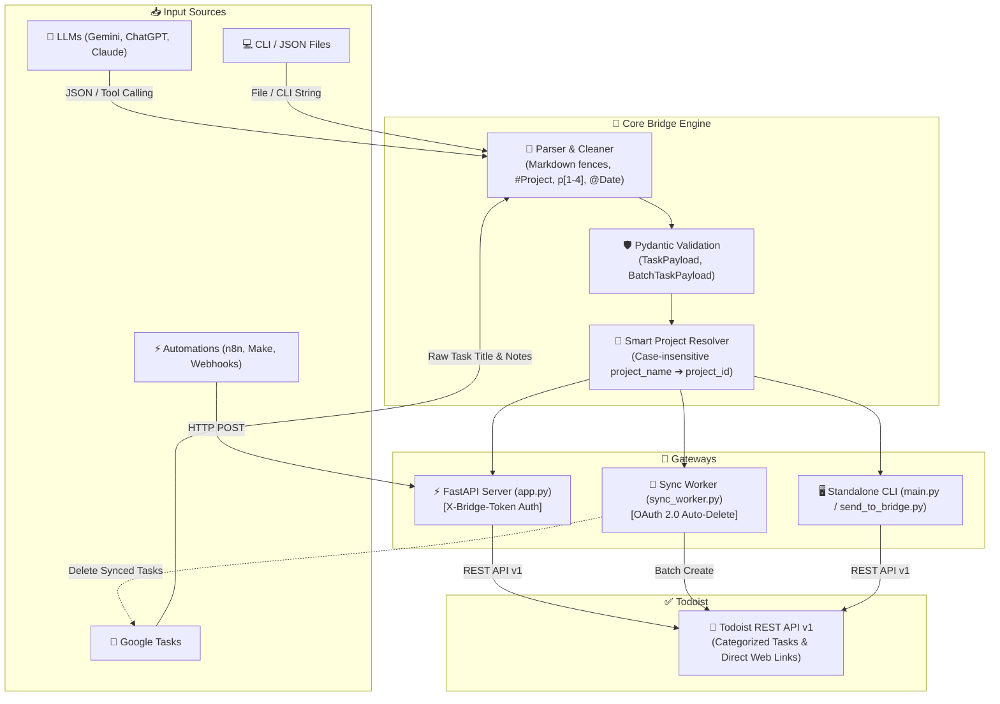

# Todoist Gemini Bridge 🌉

<p align="center">
  
  
  
  
  
  
  
</p>

<p align="center">
  <strong>A lightweight automation bridge that turns structured AI and Google Tasks input into validated Todoist tasks using FastAPI, Pydantic, OAuth 2.0, and the Todoist REST API.</strong>
</p>

<p align="center">
  <a href="#english">English</a> •
  <a href="#türkçe">Türkçe</a> •
  <a href="#architecture">Architecture</a> •
  <a href="#tests">Tests</a>
</p>

---

<a name="architecture"></a>
## 🏗️ Architecture & Data Flow / Mimari Akış



---

<a name="english"></a>
## 🇬🇧 English

A Python automation bridge that parses structured task JSON generated by AI LLMs (Gemini, ChatGPT, Claude) or automation workflows (Google Tasks, n8n, Make) and batch-creates them in Todoist via the official REST API with automatic project mapping, due date assignment, and validation.

### 🌟 Features

- **Pydantic Validation:** Strict type-safe schema verification for individual and batch task creation payloads.
- **Markdown & JSON Extraction:** Automatic cleaning and stripping of markdown code fences (````json ... ````) from raw LLM responses.
- **Google Tasks → Todoist Sync Worker (`sync_worker.py`):** OAuth 2.0 daemon that reads tasks from Google Tasks, extracts tags (`#Project`, `p[1-4]`, `@Date`), pushes them to Todoist, and removes them from Google Tasks.
- **Smart Project Resolution:** Resolves human-readable `project_name` to Todoist `project_id` via dynamic case-insensitive lookup. Defaults safely to `Inbox` if not matched.
- **FastAPI Webhook API (`app.py`):** FastAPI REST endpoints with CORS support and pre-shared token authentication (`X-Bridge-Token`).
- **CLI Dispatcher (`send_to_bridge.py`):** Standalone command-line client to transmit task payloads to your self-hosted bridge server.
- **Direct CLI Runner (`main.py`):** Standalone script to create tasks directly in Todoist without running a server.
- **Gemini Tool Declaration (`gemini_tool_schema.json`):** Ready-to-use Google Gemini Function Calling schema.
- **Up-to-Date Todoist API v1:** Fully compliant with the latest Todoist API endpoints (`https://api.todoist.com/api/v1`).
- **Rich Terminal Summary:** Formatted and colored summary table with direct clickable links to created tasks on Todoist web app.

### 📁 Project Structure

```text
Todoist-Gemini-Bridge/
├── app.py                  # FastAPI Web Application & REST API
├── send_to_bridge.py       # Standalone CLI client for FastAPI webhook
├── sync_worker.py          # Google Tasks → Todoist sync worker
├── config.py               # Environment variables & Pydantic settings
├── models.py               # TaskPayload & BatchTaskPayload Pydantic schemas
├── parser.py               # JSON cleaner and parser
├── todoist_client.py       # Todoist REST API client with error handling
├── main.py                 # Direct Todoist CLI runner & table formatter
├── gemini_tool_schema.json # Gemini Function Calling / Tool Schema
├── tasks_sample.json       # Sample task template
├── tests/                  # Pytest test suite (19 unit & integration tests)
├── requirements.txt        # Python dependencies
└── .env.example            # Environment variable template
```

### 🚀 Getting Started

#### 1. Clone the Repository
```bash
git clone https://github.com/kagankurubas/Todoist-Gemini-Bridge.git
cd Todoist-Gemini-Bridge
```

#### 2. Setup Virtual Environment & Install Dependencies
```bash
python -m venv venv

# On Windows (PowerShell):
.\venv\Scripts\activate

# On macOS / Linux:
source venv/bin/activate

pip install -r requirements.txt
```

#### 3. Configure API Credentials
Copy `.env.example` to `.env` and configure your tokens:
```bash
cp .env.example .env
```
Inside `.env`:
```env
TODOIST_API_TOKEN=your_todoist_api_token_here
WEBHOOK_SECRET_TOKEN=supersecret
```

---

### 🛠️ Usage Methods

#### Method 1: Google Tasks Sync Worker (`sync_worker.py`)
Sync and auto-delete tasks with inline tags (`#Project`, `p[1-4]`, `@Date`):
```bash
# Continuous watcher mode (every 15s)
python sync_worker.py --watch --interval 15

# One-shot synchronization
python sync_worker.py
```

#### Method 2: Direct CLI (No Server Required)
```bash
# From a JSON file
python main.py --file tasks_sample.json

# Direct JSON string
python main.py --json '[{"content": "Read book", "due_string": "today", "priority": 2}]'

# Interactive input (paste JSON and press Ctrl+Z / Enter on Windows, Ctrl+D on Unix)
python main.py
```

#### Method 3: FastAPI Webhook Service (`app.py`)
```bash
uvicorn app:app --reload --port 8000
```
Interactive Swagger API docs: `http://127.0.0.1:8000/docs`.

**Example cURL Request:**
```bash
curl -X POST "http://127.0.0.1:8000/tasks" \
  -H "Content-Type: application/json" \
  -H "X-Bridge-Token: supersecret" \
  -d '[
    {
      "content": "Review Pull Requests",
      "project_name": "Inbox",
      "due_string": "tomorrow at 10:00",
      "priority": 3
    }
  ]'
```

#### Method 4: Dispatcher Client (`send_to_bridge.py`)
```bash
python send_to_bridge.py --file tasks_sample.json
```

---

<a name="türkçe"></a>
## 🇹🇷 Türkçe

Yapay zeka modellerinden (Gemini, ChatGPT, Claude vb.) veya otomasyon araçlarından (Google Tasks, n8n, Make) üretilen yapılandırılmış JSON görev çıktılarını Todoist API'si üzerinden tek seferde, doğru projelere ve tarihlere otomatik eşleyerek ekleyen Python köprüsü.

### 🌟 Özellikler

- **Pydantic ile Şema Doğrulama:** Tekil veya toplu görev verilerinin tiplerini ve şemalarını doğrular.
- **Google Tasks → Todoist Senkronizasyonu (`sync_worker.py`):** Google Tasks'teki görevleri okur, etiketleri (`#Proje`, `p[1-4]`, `@Tarih`) ayrıştırır, Todoist'e ekler ve aktarılanları Google Tasks'ten siler.
- **Markdown & JSON Ayıklama:** LLM çıktılarındaki markdown formatlı kod bloklarını (````json ... ````) temizler.
- **Akıllı Proje Eşleme:** Görevdeki `project_name` değerini Todoist'teki projelerinizle eşleştirir.
- **FastAPI Webhook API (`app.py`):** CORS desteği ve `X-Bridge-Token` başlık kimlik doğrulaması içeren FastAPI REST uç noktaları.
- **İstemci Script'i (`send_to_bridge.py`):** Webhook sunucunuza terminalden görev gönderir.
- **Doğrudan CLI (`main.py`):** Sunucusuz doğrudan Todoist'e görev ekler.
- **Gemini Araç Şeması (`gemini_tool_schema.json`):** Gemini Function Calling formatına hazır şema.

### 📁 Proje Yapısı

```text
Todoist-Gemini-Bridge/
├── app.py                  # FastAPI Web Uygulaması ve REST API
├── send_to_bridge.py       # FastAPI webhook istemcisi (CLI)
├── sync_worker.py          # Google Tasks → Todoist senkronizasyon servisi
├── config.py               # Çevre değişkenleri ve Pydantic settings yönetimi
├── models.py               # TaskPayload ve BatchTaskPayload Pydantic modelleri
├── parser.py               # JSON temizleyici ve ayrıştırıcı
├── todoist_client.py       # Hata yönetimi içeren Todoist REST API istemcisi
├── main.py                 # Doğrudan Todoist CLI çalıştırıcısı ve tablo formatlayıcı
├── gemini_tool_schema.json # Gemini Function Calling / Tool Şeması
├── tasks_sample.json       # Örnek görev şablonu
├── tests/                  # Pytest test paketi (19 birim ve entegrasyon testi)
├── requirements.txt        # Python bağımlılıkları
└── .env.example            # Çevre değişkeni şablonu
```

### 🚀 Kullanım

```bash
# 1. Google Tasks Senkronizasyonu (15 saniyede bir)
python sync_worker.py --watch --interval 15

# 2. Dosyadan Doğrudan Todoist'e Ekleme
python main.py --file tasks_sample.json

# 3. Webhook Sunucusunu Başlatma
uvicorn app:app --reload --port 8000

# 4. Webhook'a İstemci ile Görev Gönderme
python send_to_bridge.py --file tasks_sample.json
```

---

<a name="tests"></a>
## 🧪 Testing / Testleri Çalıştırma

Projede 19 adet birim ve entegrasyon testi yer almaktadır:

```bash
# Tüm testleri çalıştırmak için:
pytest

# Detaylı çıktı ile çalıştırmak için:
pytest -v
```

---

## 📋 JSON Schema / Örnek JSON

```json
[
  {
    "content": "Read 10 pages of book",
    "project_name": "Focus & Growth",
    "due_string": "today",
    "priority": 2,
    "description": "Daily reading habit goal"
  },
  {
    "content": "Review pull requests",
    "project_name": "Inbox",
    "due_string": "tomorrow",
    "priority": 3,
    "description": "Check open PRs on GitHub"
  }
]
```

---

## 📄 License / Lisans

This project is licensed under the [MIT License](LICENSE).  
Bu proje [MIT Lisansı](LICENSE) kapsamında lisanslanmıştır.
